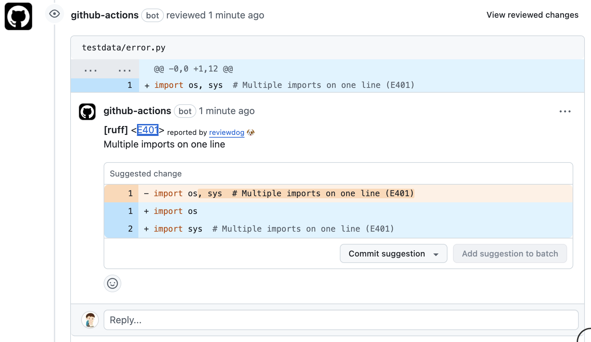

# GitHub Action: Run ruff with reviewdog

[](https://github.com/benny123tw/action-ruff/actions?query=workflow%3Adepup)
[](https://github.com/benny123tw/action-ruff/actions?query=workflow%3Arelease)
[](https://github.com/benny123tw/action-ruff/releases)
[](https://github.com/haya14busa/action-bumpr)
<!-- [](https://github.com/haya14busa/github-used-by/tree/main/repo/reviewdog/action-eslint) -->

This action runs [ruff] with
[reviewdog] on pull requests to improve
code review experience.

[](https://github.com/benny123tw/action-ruff/pull/1)

## Inputs

### `github_token`

**Required**. Default is `${{ github.token }}`.

### `level`

Optional. Report level for reviewdog \[`info`,`warning`,`error`\].
It's same as `-level` flag of reviewdog.

### `reporter`

Reporter of reviewdog command \[`github-pr-check`,`github-check`,`github-pr-review`\].
Default is `github-pr-review`.
It's same as `-reporter` flag of reviewdog.

`github-pr-review` can use Markdown and add a link to rule page in reviewdog reports.

### `filter_mode`

Optional. Filtering mode for the reviewdog command \[`added`,`diff_context`,`file`,`nofilter`\].
Default is added.

### `fail_level`

Optional. If set to `none`, always use exit code 0 for reviewdog. Otherwise, exit code 1 for reviewdog if it finds at least 1 issue with severity greater than or equal to the given level.
Possible values: [`none`, `any`, `info`, `warning`, `error`]
Default is `none`.

### `fail_on_error`

Deprecated, use `fail_level` instead.
Optional. Exit code for reviewdog when errors are found \[`true`,`false`\]
Default is `false`.

### `reviewdog_flags`

Optional. Additional reviewdog flags

### `ruff_flags`

Optional. Flags and args of ruff command.

### `workdir`

Optional. The directory from which to look for and run eslint. Default '.'

### `changed_files`

Optional. Whether to only run Ruff on changed files. Defaults to `true`.
Default is `true`.

## Example usage

This action installs [uv] and [reviewdog] for you. It runs [ruff] with [uvx], so there's no need for manual installation.

### [.github/workflows/reviewdog.yml](.github/workflows/reviewdog.yml)

```yaml
name: reviewdog
on: [pull_request]
jobs:
  ruff:
    name: runner / ruff
    runs-on: ubuntu-latest
    permissions:
      contents: read
      pull-requests: write
    steps:
      - uses: actions/checkout@v4
      - uses: benny123tw/action-ruff@v1
        with:
          github_token: ${{ secrets.GITHUB_TOKEN }}
          reporter: github-pr-review # Change reporter.
```

You can also set up uv and ruff manually like below.

```yml
name: reviewdog
on: [pull_request]
jobs:
  eslint:
    name: runner / eslint
    runs-on: ubuntu-latest
    steps:
      - uses: actions/checkout@v4
      - name: Install uv
        uses: astral-sh/setup-uv@v5
        with:
          enable-cache: true
          cache-dependency-glob: "uv.lock"
      - name: Set up Python 3.12
        run: uv python install 3.12
      - run: uv sync --frozen
      - uses: benny123tw/action-ruff@v1
        with:
          reporter: github-check
```

## Acknowledgments

action-ruff is made possible thanks to the inspirations from the following resources and projects:

* [Python プロジェクトをReviewdogでチェックする](https://kujilabo.com/2023/03/13/2023/03/python_003/)
* [Add RDJson support #11682](https://github.com/astral-sh/ruff/pull/11682)
* [reviewdog/action-eslint](https://github.com/reviewdog/action-eslint)
* [astral-sh/ruff-action](https://github.com/astral-sh/ruff-action)

[uv]: https://docs.astral.sh/uv/
[uvx]: https://docs.astral.sh/uv/guides/tools/#running-tools
[ruff]: https://docs.astral.sh/ruff/
[reviewdog]: https://github.com/reviewdog/reviewdog